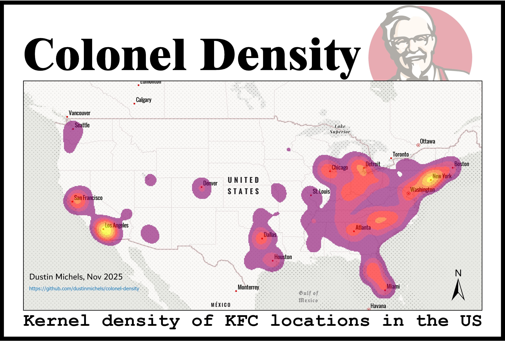

# Colonel Density

Kernel density map of KFC locations.



## About

I wrote a web scraper in Go that gets the addresses of KFC locations from [locations.kfc.com](https://locations.kfc.com/).

```sh
cd scraper
go run .
```

Some stores have lat/lon. Some do not. So next I wrote a python script that attempts to geocode the addresses that are missing lat/lon using geopy (Nominatim / OpenStreetMap).

```sh
cd process
uv run main.py
```

This geocoded all but 200/~4000 locations. The rest were geocoded with ArcGIS pro.

Then a kernel density map was crated using ArcGIS Pro.
